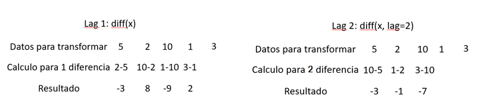

```{r setup, include=FALSE}
if (requireNamespace("thematic")) 
  thematic::thematic_rmd(font = "auto")
```

# Introducción


## Descargar los datos:

Para descargar los datos, es importante conocer en que extención se encuentran guardados y así utilizar el recurso correcto. El siguiente es el utilizado par datos guardados con excel.

**readxl**: Necesario para leer archivos excel

```{r}
library(readxl)
```

Cuando se descargue la base de datos, es importante tener encuenta que:

**1.** Se tiene información histórica suficiente dependiendo de la periodicidad definida al inicio del estudio. Esto quiere decir que si se tiene información mensual debería ser por varios años, si se determina que es un estudio de algunos meses, debe tenerse por varios días.

**2.** Esta información debe ser continua en el tiempo, es decir que cubra todo el periodo escogido y que la separación temporal sea constante.

**3.** Que si falta información sea muy poca, preferiblemente no mayor al 20%, lo que permitiría calcular los datos faltantes para que no comprometa de forma importante la información que se pueda extraer de los datos.

*Ejemplo:* Estos datos corresponden a veinte años (enero de 1979 a diciembre de 1998) de registros de muertes totales en Colombia, que se encuentran en la pagina del DANE (<https://www.datos.gov.co/widgets/kk5w-ugzm>), es decir 240 datos. Como se puede ver, la base de datos tiene tres columnas, la primera de ella es un número consecutivo desde la fecha más lejana en el tiempo, hasta la fecha más reciente, la segun hace referencia a los meses y la tercera columna son los conteos de muertes por mes en cada año.

```{r}
ColombiaT <- read_excel("ColombiaT.xlsx")
head(ColombiaT)
```


## Revisión de base de datos
Esto sirve para identificar las variables de la base de datos y que tipo de variables son.
```{r}
summary(ColombiaT)
```
## Datos faltantes
https://datascienceplus.com/imputing-missing-data-with-r-mice-package/
https://www.youtube.com/watch?v=An7nPLJ0fsg&list=RDCMUCuWECsa_za4gm7B3TLgeV_A&index=7

### Librerias necesarias:
**mice**: Este paquete lo ayuda a imputar valores faltantes con valores de datos plausibles. Estos valores plausibles se extraen de una distribución diseñada específicamente para cada punto de datos faltante.La creación de múltiples imputaciones para que sea seleccionada la más adecuada.

**VIM**: Herramientas para la visualización de valores perdidos y/o imputados, que pueden utilizarse para explorar los datos y la estructura de los valores perdidos y/o imputados. Dependiendo de esta estructura de los valores perdidos, los métodos correspondientes pueden ayudar a identificar el mecanismo que genera los valores perdidos y permite explorar los datos, incluidos los valores perdidos. Además, la calidad de la imputación se puede explorar visualmente utilizando varios métodos de gráficos univariados, bivariados, múltiples y multivariados..

**missForest**: La función 'missForest' en este paquete se usa para imputar valores faltantes, particularmente en el caso de datos de tipo mixto. Utiliza un bosque aleatorio entrenado en los valores observados de una matriz de datos para predecir los valores que faltan. Se puede utilizar para imputar datos continuos y/o categóricos, incluidas interacciones complejas y relaciones no lineales. Produce una estimación del error de imputación out-of-bag (OOB) sin la necesidad de un conjunto de pruebas o una validación cruzada elaborada. Se puede ejecutar en paralelo para ahorrar tiempo de cálculo..
```{r}
library(mice)
library(VIM)
library(missForest)
```
En el analisis de series de tiempo, un requerimiento es que no existan datos faltantes. En esta base de datos no hay datos faltantes, pero para explicar como proceder en este caso, generaremos algunos en la base de datos y procederemos a calcularlos, lo que se conoce como imputación de datos.

### Ejemplo de imputación
Como ejemplo para mostrar como proceder cuando se encuentran valores ausentes, se tomarán los datos y se eliminarán algunos valores, para luego remplazarlos por unos generados automáticamente con algunas condiciones.
Se generá una base de datos llamada ColombiaNA con 5% de valores ausentes, que se seleccionaron de forma aleatoria, y corresponden a 36, como se puede ver en el summary de los datos

Antes de eliminar algunos valores, adicionaremos dos variables que tiene una distribución normal, para tener tres varibles numéricas.
```{r}
set.seed(123)
Colombiamiss<-ColombiaT
Colombiamiss$Variable1<-rnorm(240)
Colombiamiss$Variable2<-rnorm(240)
```
Aquí lo que se hace es eliminar 5% en cada variable de forma aleatoria, para tener NAs y mostrar el procedimiento para la imputación. Se tiene un set.seed, para asegurar que siempre que se eliminen datos no varien los resultados. Esto crea resultados reproducibles completamente. Al final se produce un resultado que es el resumen donde se pueden ver las características de las variables y la cantidad de NA en cada una de ellas. 

```{r}
set.seed(123)
ColombiaNA<-prodNA(Colombiamiss[,-c(1,2)],noNA = 0.05)
summary(ColombiaNA)
```
#### Identificación de valores ausentes
Podemos usar md.pattern() para tener una idea de los patrones de datos faltantes. Esto nos muestra que en 205 filas no hay datos faltantes en ninguna variable (la fila superior azul); la siguiente fila dice que faltaban 12 individuos solo en la variable tercera, mientras que en las otras variables los datos estan completos; la fila tres muestra que faltan 12 datos en la segunda variable únicamente. Así es la forma de leer la figura que a continuación aparece. Finalmente, se encuentra que faltan 36 datos en toda la base considerada, que es el valor que aparece en la esquina inferiro derecha.

```{r}
md.pattern(ColombiaNA)
```
El gráfico de abajo nos ayuda a entender nuevamente los valores faltantes de forma diferente, pero puede ser un recurso importante para ener datos en procentajes, utilizando el recurso siguiente:
Colplot$percent: aquí encontrará valores en porcentaje de las diferentes conbinaciones de variables, por ejemplo el 85.4% de los valores no tienen datos faltantes en ninguna variable, el 5% solo la segunda variable tiene datos faltantes, el 4% solo la primera variable tiene datos faltantes, el 5% la tercera variable solo tiene datos faltantes y por últimoel 0.4% presenta datos faltantes en las dos primera variables, es decir que comparten daos faltantes esas dos variables. 

```{r}
Colplot<-aggr(ColombiaNA, col=c("blue","red"),
              numbers=TRUE, sortVars=TRUE,
              labels=names(ColombiaNA), cex.axis=.7,
              gap=3, ylab=c("Datos ausentes","Parametros"))
```

El siguiente recurso es una matriz donde se identifican la cantidad de valores faltantes
Los cuatro componentes en el valor de salida tienen la siguiente interpretación:

Patrón rr: Se observan ambas variables donde no hay valores faltantes
Patrón rm: Se observa la primera variable y falta datos de la segunda variable;
Patrón mr: Faltan datos de la primera variable, mientras que en la segunda variable estan completos
Patrón mm: Coindiden las dos variables donde no hay datos en ninguna de ellas.

```{r}
md.pairs(ColombiaNA)
```
Esta gráfica pretende mostrar la relación de dos variables, y los datos faltantes quí estamos limitados a graficar 2 variables a la vez, pero, sin embargo, podemos recopilar algunas ideas interesantes.
El gráfico de caja roja de la izquierda muestra la distribución de la variable 1 donde presenta los datos faltantes de la variable conteo, mientras que el gráfico de caja azul muestra la distribución de los puntos de datos restantes. Lo mismo ocurre con los diagramas de caja roja de la variable conteo, donde se presentan los valores faltantes de la variable 1 y la caja azul donde los datos estan completos.
Si nuestra suposición es correcta, entonces esperamos que los diagramas de caja roja y azul sean muy similares.


```{r}
marginplot(ColombiaNA[,c("conteo","Variable1")])
```

#### Imputación propiamente dicha

```{r}
imputar<-mice(ColombiaNA,m=3, seed = 123)
```

pmm: Predictive mean matching

```{r}
print(imputar)
```

```{r}
imputar$imp$conteo
```
Datos completos

```{r}
DatosF<-complete(imputar,1)
```

#### Datos observados vs imputados
Se puede obtener otra toma visual útil de las distribuciones usando la función stripplot() que muestra las distribuciones de las variables como puntos individuales.
```{r}
stripplot(imputar,pch=20,cex=1.2)
```

Comparando la distribución de los datos originales y los imputados. En este caso se utiliza el diagrama de dispersión del conteo con lad sos varialbes restantes 1 y 2. Se puede observar que los valores imputados, aquí en color verde, estan muy cercanos a los valores originales en color amarillo


```{r}
xyplot(imputar,conteo ~ Variable2+Variable1,pch=18,cex=1)
```

Lo que nos gustaría ver es que la forma de los puntos verde (imputados) coincida con los amarillos (observados). La forma coincidente nos dice que los valores imputados son de hecho "valores plausibles".

#### Otro gráfico útil es el gráfico de densidad:
La densidad de los datos imputados para cada conjunto de datos imputados se muestra en magenta, mientras que la densidad de los datos observados se muestra en azul. Nuevamente, bajo nuestros supuestos anteriores, esperamos que las distribuciones sean similares.

```{r}
densityplot(imputar)
```

## Series de tiempo
Para realizar un análisis de series de tiempo es indispensable tener claros varios aspectos tales como:

1.  Objetivo(s) que se buscan

2.  Identificar los datos que se requieren para cumplir ese(os) objetivo(s)

3.  Determinar la periodicidad que se requiere (años, meses, días, horas, etc.)

4.  Tener claro el nivel de cobertura que se va a utilizar (municipal, regional, departamental, nacional, etc.)
5. No tener datos perdidos(NAs) y si los tiene debe ser menor al 20%, ya que con esta copndición se pueden calcular los perdidos por varios metodos que se conocen como imputación de datos.

### Librerias necesarias:

En R se encuentram una gran cantidad de recursos y librerias que permiten trabajar series de tiempo. Los siguientes son los recomendados por una gran cantidad de personas que trabajan en estos temas. Según la Red Integral de Archivos en R (CRAN: por sus siglas en ingles: Comprehensive R Archive Network), los paquetes presentados aquí son:
**modeltime**: Es una extensión del ecosistema Tidymodels para el modelado de series temporales. Los modelos incluyen ARIMA, Suavizado exponencial y modelos de series de tiempo adicionales de los paquetes 'forecast' y 'prophet'.

**tidyverse**: Es un conjunto de paquetes que permite la organización de bases de datos, el manejo y la graficación de resultados. Los paquetes incluidos son: dplyr,ggplot2, forecast, tibble, readr, stringr, tidyr y purrr.

**forecast**: Métodos y herramientas para mostrar y analizar pronósticos de series temporales univariadas, incluido el suavizado exponencial a través de modelos de espacio de estado y el modelado ARIMA automático.

**tseries**: Permite plotear y análizar series de tiempo de forma sencilla.

**gtable**: Herramientas para facilitar el trabajo con tablas.

**TSstudio**: Proporciona un conjunto de herramientas para el análisis descriptivo y predictivo de datos de series temporales. Eso incluye funciones para la visualización interactiva de objetos de series temporales y también funciones de utilidad para la automatización de pronósticos de series temporales.

Las figuras generadas por este medio, presentarán una serie de herramientas en la parte superior: La primera de ellas es la imagen de una camara fotográfica que permite descargar la imagen en .png, a continuación encontrará una lupa para realizar zoom a la figura en un sector específico, luego una cruz, que es una herramienta si es necesario navegar por entre la figura debido a que el pantallazo es muy pequeño. A continuación, aparecen un más (+) y un menos (-), que tambien es un tipo de zoom pero sin especificar la region que se quiere revisar. Luego aparece una X en un recuadro que permite volver al estado inicial de la imagen eliminando los zoom previos.

```{r}
library(modeltime)
library(tidyverse)
library(forecast)
library(tseries)
library(gtable)
library(TSstudio)
library(bookdown)
```

### Conversión a serie de tiempo:
Para poder hacer un análisis de series de tiempo debe estar en forma de matriz donde la primera columna son los años y las siguientes columnas son los meses como aparece a continuación. Se recomienda generar las fechas a partir de un script de R, para no tener problemas de reconocimiento por parte del sistema. El script presentado abajo, inicia teniendo en cuenta la tercera columna (conteo), luego se conbierte los datos en series de tiempo con la función ts y se le especifica el rango del tiempo considerado, especificando donde inicia 1979,1(1979, enero) y donde termina 1998-12 (1998, diciembre), con una frecuencia de 12, ya que se tiene información de los doce meses del año. Cuando se pide mostrar la serie de tiempo (Datos.ts), aparece la estructura. Al utilizar la función glimpse(Datos.ts), como resultado aparece la confirmación que los datos ya tienen un formato de serie de tiempo y las funciones start(Datos.ts);end(Datos.ts), nos mostrará la fecha de inicio y la fecha de terminación de la serie de tiempo.

```{r}
Datos.ts<-ColombiaT$conteo %>% 
  ts(start=c(1979,1), end=c(1998,12),frequency=12)
Datos.ts
glimpse(Datos.ts)
start(Datos.ts);end(Datos.ts)
```

### Análisis exploratorio :

#### Primer componente estacionario

El recurso inicial visual de la presentación de los datos en una gráfica que incluye en el eje X el tiempo ordenado cronológicamente y en el eje Y las variaciones de los datos unida por una linea y sin valores ausentes. Para esto se utiliza la función ts_plot, acompañada de los nombres de los ejes. Más información en: <https://jesusbz.github.io/modelo-ventas.html>

```{r results = "hold", fig.cap = "**Figura 1**. Ploteo de la serie de tiempo con los datos originales, para iniciar un análisis exploratorio de forma visual donde se podrá identificar si existe una tendencia en los datos de incremento o decremento y si presenta cambios en la variabilidad a travez del tiempo.", warning = FALSE, echo=FALSE}
ts_plot(Datos.ts,
        title = "",
        Ytitle = "Numero de muertes totales",
        Xtitle = "Tiempo por meses", 
        slider = TRUE)
```

#### Segundo componente estacional:

Permite identificar un patron estacional, mostrando la distibución de las muertes separada para cada año considerado, en cada mes. Esta figura es muy útil y posee un recurso interactivo interesante, ya que en la margen derecha, estan los colores que representan cada año y parandose en el que desen, pueden apagarlo o prenderlo, con el fin de verificar cada año por separado. Nuevamente si el cursor pasa por cualquier lines dibujada, se presentará el dato del mes y el valor, que en este caso es la cantidad de muertes totales correspondiente.

```{r results = "hold", fig.cap = "**Figura 2**. Imagen interactiva donde se muestra el componente estacional para cada año de forma independiente de la serie de tiempo", warning = FALSE, echo=FALSE}
ts_seasonal(Datos.ts, type = "normal")
```

#### Tercer componente estacional:

Se utiliza para identificar tendencias y patrones entre unidades del ciclo, en este caso son los meses los que se pueden manipular para ver las tendencias de cada uno o compararlos con otros de ellos, utilizando para esto la herramienta que aparece en la mano derecha, donde se pueden apagar o prender cada mes, según lo deseado.

```{r results = "hold", fig.cap = "**Figura 3**. Imagen interactiva donde se muestra el componente estacional para cada mes de forma independiente de la serie de tiempo", warning = FALSE, echo=FALSE}
ts_seasonal(Datos.ts, type = "cycle")
```

#### Cuarto componente estacional:

Se utiliza para identificar tendencias y patrones entre unidades del ciclo pero con box plot, que muestra la distribución de los datos en cada unidad del ciclo. Esta figura es muy importante para ver la distibución de los datos para cada mes en el rango de estudio. Nuevamente presenta la posibilidad de apagar o prender cada mes por separado y realizar comparaciones.

```{r results = "hold", fig.cap = "**Figura 4**. Imagen interactiva donde se muestra la distribución de datos en box plot por cada mes a lo largo de los 20 años considerados", warning = FALSE, echo=FALSE}
ts_seasonal(Datos.ts, type = "box")
```

#### Componentes totales

En la figura siguiente se muestra otro recurso visual pero en este caso tidimencional, donde esta representada la relación entre años, meses y valores en este caso de muertes totales. En esta figura aparece dos herramienta adicional, en la parte superior que permitirán rotar la imagen en cualquier eje, para ver con más claridad la distribución de los datos. Además, al desplazarse por la imagen se puede contrar en cualquier punto la informaci´pon de las tres variables consideradas aquí.

Si desea revisar más sobre el recurso visite: <https://rpubs.com/ramkrisp/TSstudio>

```{r results = "hold", fig.cap = "**Figura 5**. Imagen interactiva donde se muestra una gráfica tridimencional relacionando año, mes y cantidad de muertes totales en la serie de tiempo", warning = FALSE, echo=FALSE}
ts_surface(Datos.ts)
```

### Análisis visual de los datos buscando estacionariedad

Todos los análisis de series de tiempo deben cumplir con dos requisitos necesarios para poder confiar en el fin último de predecir valores a corto plazo, utilizando para esto datos históricos.

1.  Los datos deben cumplir con la condición de **estacionariedad**, es decir que no tengan una tendencia de incremento o decremento, lo que es lo mismo decir: media cero a lo largo de su extensión

2.  Cumplir con la condición de **homocedasticidad**, es decir que los datos se mantengan a lo largo del tiempo con la misma variabilidad.

Para esto hay varias formas de identificar estas condiciones. La primera es visual, donde se plotea la descomposición de los datos en tres componentes:

Serie observada = Tendencia + Efecto estacional + Residuos.

En la imagen aparecerá la figura de los datos completos (Observed), tendencia (Trend), que es el recurso para verificar si presenta incremento o decremento en la serie de tiempo, estacionalidad (Seasonal), donde se puede identificar si se presentan condiciones repetidas cada cierto tiempo) y los datos aleatorios (Random o residuos), que es el componente aleatorio de los datos debido a otras variables fortuitas. La función que se utiliza es: ts_plot(decompose(Datos.ts, type = "")), se podría especificar en type, si se quiere additive (aditivo) i multiplicative (multiplicativo), o como en este caso los dos tipos al mismo tiempo ("both"), Si se detecta visualmente una heterocedasticidad de los datos, se tendría en cuenta el tipo multiplicative. Una de las transformaciones que podrían utilizarse cuando se detecte heterocedasticidad de los datos a lo largo del tiempo, es la utilización de logaritmo natural (log). <https://www.youtube.com/watch?v=w-FAPJ9kLo4>

```{r results = "hold", fig.cap = "**Figura 6**. Descomposición de la serie de tiempo para identificar los componentes de tendencia, estacionalidad y elementos aleatorios presentes.", warning = FALSE}
ts_decompose(Datos.ts, type = "both")
```

El segundo recurso gráfico, hace referencia a lo que se conoce como figura para el análisis autregresivo, donde se establece una figura que presenta la correlación del valor en el momento t con el t-1 (un rezago) y de ahí hacia atrás, que puede dar información importante para tomar decisiones respecto a lo que se debería hacer con los datos antes del análisis. Para saber como se calculan la utocorrelación, sugiero que se vean erl siguiente tutorial: <https://www.youtube.com/watch?v=ioRbWW-oEVI>. Importante tener en cuenta que la gráfica auto regresiva hace referencia especialmente al componente de medias moviles, y cuantas se deberian tener en cuenta. Como se puede ver abajo, la disposición de la autoregresión primera, es típica de datos sin estacionariedad, es decir que los datos de t y t-1 se encuentan correlacionados altamente y van disminuyendo esa correlación, mientras más lejos esté históricamente, generando una reducción paulatina.

Para generar este recurso visual se utilizará el script: ts_cor(Datos.ts,lag.max = 60), el cual permitirá ver las autocorrelaciones y las autocorrelacions parciales con retrazo de 60 meses, y se podrán identificar posibles estacionalidades en la serie de tiempo.

La lineas punteadas horizontales y paralelas de color verde, estan mostrando la banda de confianza al 95%, donde se presentaria lo que se conoce como ruido blanco (que no presenta autocorrelación negativa o positiva)

```{r results = "hold", fig.cap = "**Figura 7**.Resultados de la autoregresión de los valores originales de la serie de tiempo. Se puede ver que se identifica la estacionalidad (barras rojas) cada 12 meses. Las linea verdes punteadas, delimitan una zona de no significancia de la correlación a un 95%.", warning = FALSE}
ts_cor(Datos.ts,lag.max = 60)
```

Como se puede ver la figura de autocorrelación (parte superior), tiene ese descenso paulatino de las correlaciones típico de los datos con estacionariedad. Pero además identifica una estacionalidad cada 12 meses (barras rojas) y la figura de abajo, se muestra el modelo autoregresivo pero parcial, que identifica nuevamente la estacionalidad cada 12 meses.

### Graficar por mes

Buscando estacionariedad en la estacionalidad, es decir que tambien debe presentarse media cero y homocedasticidad en cada unidad de tiempo, en este caso en cada mes a lo largo del año. El comando cycle determina la unidad de tiempo a la que pertenece cada observación de la serie, en este caso son 12 meses. Los resultados que se presentan es que existe para cada mes una tendencia creciente, pero parece existir homocedasticidad de los datos. <https://rpubs.com/palominoM/series>

```{r results = "hold", fig.cap = "**Figura 8**.Analisis de tendencia y homocedasticidad de los datos originales para cada unidad de tiempo considerada en este caso (mes), que permitirá tomar decisiones sobre la transformación de los datos para asegurar estacionariedad.", warning = FALSE}
par(mfrow=c(1,2), mar=c(4,4,4,1)+.1)
Datosmes<-monthplot(Datos.ts, col = "midnightblue",ylab="Datos originales", xlab= "Meses considerados en los 20 años")
Datosmes
Datos<-Datos.ts
boxplot(Datos~cycle(Datos))
```

### Análisis estadísticos buscando estacionariedad

Esta es una forma más clara y contundente de identificar la estacionariedad de la serie de tiempo y es la utilización del test Dickey-Fuller, donde plantea:

Hipotesis nula (Ho): la serie no presenta estacionariedad p\>0.05.

Hipotesis alterna (Ha): la serie presenta estacionariedad p\<0.05

```{r}
adf.test(Datos.ts, alternative="stationary", k=1)
```

El resultado encontrado, diria que la serie presentaria estacionariedad, ya que p es menor que 0.05. Sin embargo, al solicitar la cantidad de diferenciaciones que se requieren en los datos, se encuentra que es necesario un paso adicional

### Transformación de datos:

Cuando se encuentra que no hay estacionariedad de los datos, es importante transformarlos para que cumplan esta condición, es así como se recomienda utilizar el siguiente script, que nos dirá el ndiffs: número de diferencias requeridas para que la serie total sea estacionaria. nsdiffs: determine the numero of diferencias estacionales se requerien para convertirlo en estacionario. El resultado de este análisis es que se requiere una diferenciación en los datos totales y no se necesita realizar ninguna diferenciación en los datos estacionales. En la siguiente figura se puede entender como se diferencian los datos con un retrazo y con dos, lo que en teoría convertirán datos estacionarios en datos no estacionarios

{withd="100%"}

A continuación se evaluan la cantidad de diferenciaciones necesarias que se requieren para convertir los datos totales con estacionariedad utilizando la función ndiffes y la cantidad de diferenciación requerida para eliminar la estacionariedd de la estacionalidad, utilizando la función nsdiffs, si es que existe.

```{r}
ndiffs(Datos.ts)
nsdiffs(Datos.ts)
```

El resultado muestra que es necesario una diferenciación para los datos y que no se requiere diferenciación para eliminar la estacionariedad en la estacionalidad.

### Transformación de datos:

La siguiente es una diferenciación para eliminar la tendencia, lo que convertirá a la serie de tiempo, para poder hacer análisis y predicciones. El siguiente script permite evidenciar la no estacionariedad de los datos ya transformados por la diferenciación de nivel 1. Si en el la linea 127 aparece que la diferenciación es 2 se utilizaria el siguiente comando: diff(x, lag = 2), lo que convierte a los datos reales en datos estacionales, que es lo que se busca.

```{r results = "hold", fig.cap =  "**Figura 9**.Ploteo de los datos ya transformados teniendo en cuenta una diferenciación, donde se puede ver visualmente la posible estacionariedad de los datos despues de la transformación sugerida y la homocedasticidad.", warning = FALSE}
seriedif1=diff(Datos.ts)
ts_plot(seriedif1)
```

### Comparación datos originales (no estacionales) y de los datos con diferencias (estacionales)

En esta figura se puede apreciar las diferencias entre datos no estacionales y los datos estacionales. Cuando se revisa las dos imagenes de la columna izquierda las diferencias son evidentes. La gráfica de arriba muestra incremento a lo largo del tiempo, mientras que en la gráfica de abajo se ha eliminado ese incremento, con una media en 0, y la variabilidad no cambia visualmente, es decir que presenta homocedasticidad. En lo que respecta a las dos imagenes de la columna derecha, se presenta una comparación entre las graficas autoregresivas, donde en la parte superior presenta una típica de datos no estacionarios, es decir que los valores de autoregresión van disminuyendo paulatinamente, mientras se alejan de el valor más reciente, siendo el valor inicial relacionado con el mismo, mientras que la gráfica de abajo, presenta una autocorrelación de los valores estacionarios donde se elimina esta tendencia paulatina. Además, aparecen dos valores altamente relacionados: el primero de ellos negqativamente con un retrazo de un mes y el segundo positivamente con un retrazo de 12 meses.

```{r results = "hold", fig.cap =  "**Figura 10**.Comparación de datos originales que no presentan estacionariedad y los datos transformados realizando una diferenciación, que si la presentan.Se muestran los datos de serie de tiempo a la izquierda y las gráficas autoregresivas correspondientes.", warning = FALSE}
par(mfrow=c(2,2), mar=c(4,4,4,1)+.1)
plot(Datos.ts, ylab= "Muertes totales")
acf(Datos.ts, main="Serie que no presenta estacionariedad")
plot(seriedif1)
acf(seriedif1, main="Serie que presenta estacionariedad")
```

### Graficar por mes

<https://rpubs.com/palominoM/series> Este recurso es muy importante porque puede determinar si dentro de los meses tambien se presenta estacionariedad, es decir que no se presente una tendencia a incrementar o decrementar los valores (media=0) y si presenta homocedasticidad que es lo que se quiere. La gáfica de la izquierda muestra que no hay un incremento o decremento (no tiene tendencia), y la figura de la derecha muestra la homocedasticidad para cada mes.

```{r results = "hold", fig.cap =  "**Figura 11**.La gráfica a la izquierda muestra la evidencia que no hay una tendencia de los datos ya transformados de serie de tiempo para cada mes por separado y la gráfica de la derecha, muestra la homocedasticidad de los datos tambien para cada mes.", warning = FALSE}
par(mfrow=c(1,2), mar=c(4,4,4,1)+.1)
Estames<-monthplot(seriedif1, col = "midnightblue")
Estames
Muertesmes<-seriedif1
boxplot(Muertesmes~cycle(Muertesmes))
```

### Autocorrelacion parcial

Mide la correlaciíon existente entre una variable en distintos periodos de tiempo, pero eliminando el efecto de periodos intermedios entre el rango escogido. Si se desea más información del calculo, puede visitar este tutorial: <https://www.youtube.com/watch?v=GLbV_VEkZVA> Importante tener en cuenta que la gráfica de autoregresivos parciales hace referencia especialmente al componente autoregresivo y cuantos autoregresivos se deberian tener en cuenta. Para identificar en el modelo cuantos autoregresivos se debe considerar con el modelo original <https://www.youtube.com/watch?v=PBcdIK5oKtQ&t=8s> 14' Cuando se realiza una autoregreción parcial, nos ayuda a entender algunas cosas de los datos trabajados. Por ejemplo cuando la primera relación sea significativa y abruptamente se reduzca a valores no significativos, estariamos posiblemente frenta a valores no estacionarios, que requieren por ejemplo una diferenciación. , puede determinarse los rezagos que hay que tener en cuenta en el modelado de los datos.

```{r results = "hold", fig.cap =  "**Figura 12**.Comparación de la autoregresión parcial de los datos originales a la izquierda y los datos transformados a la derecha.", warning = FALSE}
ts_cor(seriedif1, lag.max =36)
```

### Figura de correlaciones con retrazos

En esta figura se muestran las autocorrelaciones que se presentan, con retrazo de 1, 6 y 12 meses. En estos tres retrazos se pueden ver que el primero tiene una correlación negativa, el de 6 meses continua siendo negativa, péro el de 12 meses es claramente positiva

```{r results = "hold", fig.cap =  "**Figura 13**.Comparación y relación entre autocorrelaciones en los rezagos 1, 6 y 12 meses, para la serie de tiempo.", warning = FALSE}
ts_lags(seriedif1, lags = c(1,6,12))
```

### Modelos de ajuste:

El modelo que utilizaremos es el conocido como **ARIMA**, que se descompone en los siguientes elementos

**AR (Componente autoregresivo):** hace referencia a la relación que se establece entre los datos y ellos mismos, que permitirá predecir lo que pasa hoy con respecto a lo que paso ayer o considerando un mayor rezago.

**I (Componente de diferenciación):** que puede ser de diferentes ordenes (1, 2, 3, etc.) y que se utilizan para generar estacionariedad en la serie de tiempo, que es una condición para trabajar en este tema. Ver: <https://www.youtube.com/watch?v=FeohLw3dxJE> (No se trabaja con los valores reales sino con los cambios con respecto al t-1

**MA (Medias moviles):** tiene que ver con los errores (ruido blanco)

**S (Estacionalidad)**: fenómeno que se repite

**Parámetros del modelo:** (p,d,q)(ps,ds,qs)[S] P: El orden del AR

**D (diferencias):** Este modelo permitirá identificar los elementos que se hizo referencia arriba para ajustarse a los datos de mejor forma.

En los resultados se puede identificar los parametros del modelo, que son los valores que se encuentran entre parentesis frente al termino ARIMA. El primer parentesis (parte regular del modelo) tiene valores (1,0,1), que estan representando en su orden el componente autoregresivo, componente de diferencición, el cual aparece 0 ya que estamos trabajando con la serie de tiempo diferenciada y componente de medias moviles, que corresponden a los primeros coeficientes (ar1 y ma1). En cuanto se refiere al parentesis segundo (0,0,2)(parte estacional), solo aparece el componente de medias moviles y corresponde a los otros dos coeficientes, en el resultado despues de correr el modelo. Importante decir que si se tienen varios modelos, la decisión para escoger el mejor ajuste, se utilizaría el AIC que genera el modelo o el valor log likelihood, siempre favoreciendo el valor menor.

```{r}
ModeloARIMA<- auto.arima(seriedif1)
ModeloARIMA
```

### Supuestos del modelo:

Relacionado con los residuos que deben cumplir con algunas caracterìsticas importantes. Estos residuos parecen ruido blanco, por lo que su serie presenta estacionariedad y modelada correctamente. No existe autocorrelación de los residuos.

```{r results = "hold", fig.cap =  "**Figura 13**. Presentación de los supuestos de los residuales del modelo auto.arima, donde se puedem ver que cumple todos ellos.", warning = FALSE}
tsdiag(ModeloARIMA)
```

#### Diagnosis del modelo Metodo 1

En este diagnostico tenemos:

Ho: Los residuos del modelo presentan autocorrelación p\<0.05

Ha: Los residuos del modelo presentan no presentan autocorrelación p\>0.05

En este caso los residuos no presentan autocorrelación, es decir que el modelo es correcto, y cumple con los supuestos requeridos.

```{r}
Box.test(ModeloARIMA$residuals, lag=10, type = "Ljung-Box")
```

#### Diagnosis del modelo Metodo 2

La gráfica superior no muestra una tendencia y varia al rededor del 0 de forma aleatoria, que es lo que se espera en estos casos. En la gráfica inferior izquierda, se encuentra una grafica autoregresiva, con las lineas azules punteadas paralelas, que determinan una zona donde se esperaria que los valores de los residuos no sobrepasen. En este caso solo hay uno que sobrepasa una de las lineas puneteadas, pero el valor de correlación es muy bajo. Y finalmente en la gáfica inferior derecha, se presenta la distribución normal de los residuos, que a pesar de tener una cola larga hacia la derecha, tambien se acerca a la distribución normal.
https://towardsdatascience.com/f-forecasting-5d23341462eb

```{r results = "hold", fig.cap =  "**Figura 14**. Presentación del método 2 de diagnostico, donde se puede ver el cumplimiento ellos.", warning = FALSE}
autoplot(ModeloARIMA,seasonal = TRUE)
check_res(ModeloARIMA)
```

### Comparacion de los datos observados con los esperados

En la siguiente figura se puede revisar el ajuste del modelo de forma visual

```{r results = "hold", fig.cap =  "**Figura 15**.Comparación visula del ajuste del modelo (Rojo) y los datos reales tranformados (azul).", warning = FALSE}
par(mfrow=c(1,1))
plot(ModeloARIMA$x, col="red")
lines(fitted(ModeloARIMA), col="blue")
```

### Predicción (Pronóstico)

La siguiente figura presenta la predicciòn con el modelo autoarima que se genero despues que se transformaron los datos segun lo necesario para asegurar estacionariedad y homocedasticidad. Los datos que aparecen a continuación es el pronostico que se consigue con el modelo autoarima, teniendo en cuenta que la predición se hace a 12 meses adelante, es decir que corresponde a 1999 de enero a diciembre y presenta los intervalos de confianza. Para comparar modelos revisar minuto 20 <https://www.youtube.com/watch?v=a5QQp9peaZ4>

```{r}
forecast(ModeloARIMA, h=12)
```

### Comparación visual de los pronosticos

Se genera el modelo autoarima con los datos originales

```{r results = "hold", fig.cap =  "**Figura 15**.Comparación visula del ajuste del modelo (Rojo) y los datos reales tranformados (azul).", warning = FALSE}
Modeloarima<-auto.arima(Datos.ts)
Modeloarima
```

En este caso lo que se pretende es mostrar el modelo autoarima que se consiguio con los valores históricos de los datos reales y los de los datos diferenciados y el pronóstrico para un año adelante.

```{r results = "hold", fig.cap =  "**Figura 15**.Comparación visula del ajuste del modelo (Rojo) y los datos reales tranformados (azul).", warning = FALSE}
par(mfrow=c(2,1), mar=c(4,4,4,1)+.1)
autoplot(forecast::forecast(Modeloarima,h=12))
autoplot(forecast::forecast(ModeloARIMA,h=12))
```

Modelo autoarina para los datos originales

```{r}
Modelo01<-auto.arima(Datos.ts)
Modelo01
```

### Evalución visual del modelo

Se grafican los valores reales con los valores justados con el modelo auto.arima

```{r results = "hold", fig.cap =  "**Figura 15**.Comparación visula del ajuste del modelo (Rojo) y los datos reales tranformados (azul).", warning = FALSE}
plot(Modelo01$x, col="red",xlab="Tiempo (Año y meses)",ylab="Muertes totales")
lines(fitted(Modelo01), col="blue")
```

### Evaluación de la eficacia del modelo

Se podría establecer un modelo de correlación entre los datos reales del rango entre 1979 a 1998 y los datos ajustados del modelo, para tener un valor de correlación (R2), que podría ser una medida de eficacia. En este caso el valor fue de 0.78, es decir que los valores de reales son pronosticados por los valores ajustados en un 78%.

```{r}
Eficaciamodelo<-lm(Modelo01$x~fitted(Modelo01))
summary(Eficaciamodelo)
```

Otra forma de evaluar el modelo encontrado sería comparar los valores predichos por el modelo y los valores reales del siguiente año, sea porque los tenemos en una base de datos o sea porque esperamos la finalizaciòn de ese nuevo año y lo comparamos con lo predicho hace una año. Esta sería una medida muy objetiva de la bondad de ajuste del modelo seleccionado. Es importante entender que cuando se hace un pronóstico, se debería restringir a tiempos muy cortos, por ejemplo a 12 meses en este caso. Es así que si pudieramos contar con los datos reales de ese año, en este caso 1999, ya que nuestro modelo se base en datos entre 1979 y 1998., se podrìa establecer una evaluación y generar ajustes al modelo, adicionando esa informaciòn.

Se obtienen los valores reales del año pronosticado por el modelo, es decir los muertos totales de 1999 para cada mes

```{r}
Colombia99 <- read_excel("Col99.xlsx")
head(Colombia99)
```

Aquì se organiza la informaciòn predica de los doce meses de 1999, utilizando el modelo ARIMA, utilizando para esto el modelo con los datos originales

```{r}
X<-forecast(Modelo01, h=12)
Predichos<-as.data.frame(X)
Predichos<-Predichos[,-c(2:5)]
Predichos<-as.data.frame(Predichos)
MES<- c("Ene", "Feb", "Mar", "Abr", "May", "Jun", "Jul", "Ago", "Sep", "Oct", "Nov", "Dic")
MES<-as.data.frame(MES)
Predicho99<-cbind(MES,Predichos)
```

```{r}
Ajuste<-merge(Predicho99,Colombia99, by="MES")
```

```{r}
ggplot(Ajuste, aes(x=conteo, y=Predichos)) + 
  geom_point() + theme_light()+ geom_smooth(method='lm', formula=y~x, se=FALSE, col='dodgerblue1') 
```

```{r}
mod1 <- lm(Predichos ~ conteo, data=Ajuste)
summary(mod1)
```

## Algoritmo machine learning para series de tiempo (Entrenar 80% y testeo 20%)

### Libreria necesaria primer método

```{r}
library(xgboost)
library(tidymodels)
library(lubridate)
library(timetk)
```

#### Convertir la serie de tiempo en dataframe y agregarle una columna de fecha

<https://www.youtube.com/watch?v=LZu9LHQFNZw&t=1461s> db\<-dataset %\>% dplyr::mutate(fecha_corte::tsibble::yearmonth(fecha_corte))

```{r}
DatosT<-as.data.frame(Datos.ts)
f <- as.Date("1979-01-01")
DatosT$Fecha<-seq(from=f, by="months", length.out=240)
require(reshape)
DatosT = rename(DatosT, c(x="Valores"))
```

#### Visualización interactiva

```{r}
DatosT %>% 
  plot_time_series(Fecha,DatosT$Valores,.interactive = TRUE)
```

#### Generar los datos de entrenamiento y testeo del modelo

Importante tener en cuenta que cuando se generan los datos para entrenamiento y testeo, no se puede realizar aleatoriamente, sino deben separarse dos grupos sin perder la cronología de los datos, es decir que el 80% seran los datos primeros y el 20% deberian ser los datos finales

```{r}
splits= initial_time_split(DatosT, prop=0.9)
glimpse(training(splits))
plot.ts(training(splits))
glimpse(testing(splits))
plot.ts(testing(splits))
```

#### Entrenar el modelo (auto-arima)

```{r}
Modelo1Nboots<-arima_reg() %>% 
  set_engine(engine = "auto_arima") %>% 
  fit(Valores~Fecha,data=training(splits))
Modelo1Nboots
```

#### Calibracion del modelo

```{r}
Calibracion<-Modelo1Nboots %>% 
  modeltime_calibrate(new_data = testing(splits))
Calibracion$.calibration_data
```

#### Ploteo real y predicho

```{r}
Calibracion %>% 
  modeltime_forecast(new_data = testing(splits),actual_data = DatosT) %>% 
  plot_modeltime_forecast(.legend_max_width = 25, .interactive = T)
```

#### Evaluacion del o los modelo(s)

Modelos adicionales par agregar: <https://www.youtube.com/watch?v=iC4Z1ldNRxY&t=3967s> En 1h 8' se adiciona posibilidades de manejar manualmente el orden=c (0,1,1) y estacionalidad seasonal=c(0,0,1)

Donde se mira estos indices: <https://www.youtube.com/watch?v=5SJrPLRJJ8Q&t=2322s> 38' MAE: Error absoluto medio

MAPE: Porcentaje de error absoluto medio

MASE: Escala de error absoluto medio

SMAPE: Porcentaje de error abosouto medio

RMSE: Root mean squared error

RSQ: R cuadrado

```{r}
Calibracion %>% 
  modeltime_accuracy() %>% 
  table_modeltime_accuracy(.interactive = T)
```

### Libreria necesaria segundo método

Revisar: <https://github.com/RamiKrispin/TSstudio>

```{r}
library(TSstudio)
library(forecast)
```

#### Modelo de pronostico de entrenamiento

```{r}
Dtos_s <- ts_split(ts.obj = Datos.ts, sample.out = 12)
train <- Dtos_s$train
test <- Dtos_s$test
```

#### Predicción con autoarima

```{r}
md <- auto.arima(train)
fc <- forecast(md, h = 12)
```

#### Ploteo datos reales y ajustados y la predicción

```{r}
test_forecast(actual = Datos.ts, forecast.obj = fc, test = test)
```

#### Ploteo de predicción

```{r}
plot_forecast(fc)
```

#### Comparación de diferentes métodos

```{r}
methods <- list(ets1 = list(method = "ets",
                            method_arg = list(opt.crit = "lik"),
                            notes = "ETS model with opt.crit = lik"),
                ets2 = list(method = "ets",
                            method_arg = list(opt.crit = "amse"),
                            notes = "ETS model with opt.crit = amse"),
                arima1 = list(method = "arima",
                              method_arg = list(order = c(1,1,0)),
                              notes = "ARIMA(1,1,1)"),
                arima2 = list(method = "arima",
                              method_arg = list(order = c(1,1,1),
                                                seasonal = list(order = c(0,0,2))),
                              notes = "SARIMA(1,1,1)(0,0,2)"),
                hw = list(method = "HoltWinters",
                          method_arg = NULL,
                          notes = "HoltWinters Model"),
                tslm = list(method = "tslm",
                            method_arg = list(formula = input ~ trend + season),
                            notes = "tslm model with trend and seasonal components"))
```

#### Entrenando los modelos

```{r}
md <- train_model(input = Datos.ts,
                  methods = methods,
                  train_method = list(partitions = 6, 
                                      sample.out = 12, 
                                      space = 3),
                  horizon = 12,
                  error = "MAPE")
```

#### Ploteo del rendimiento de los diferentes modelos en las particiones de prueba

```{r}
plot_model(md)
```